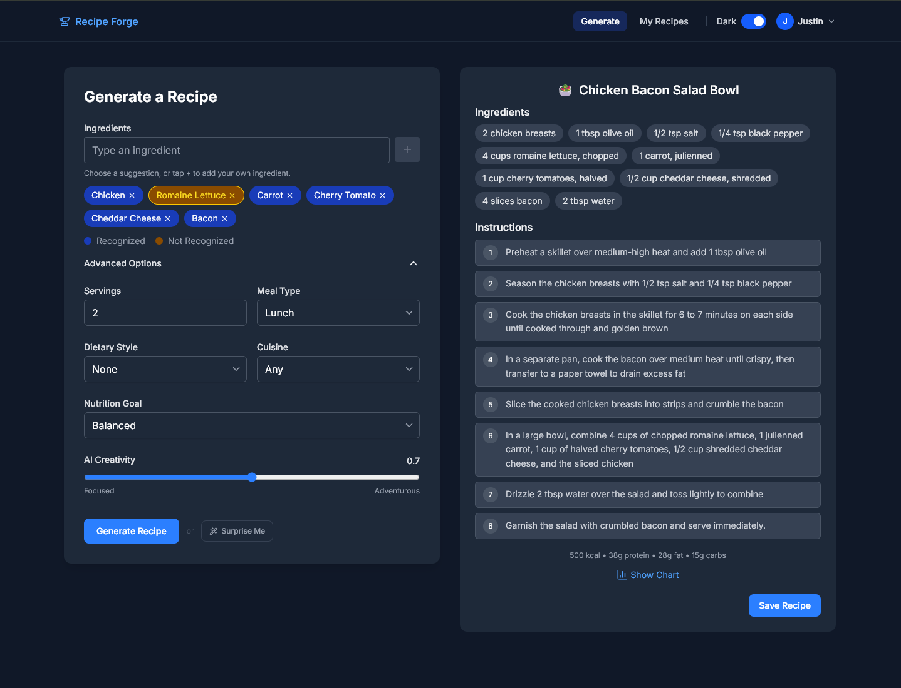
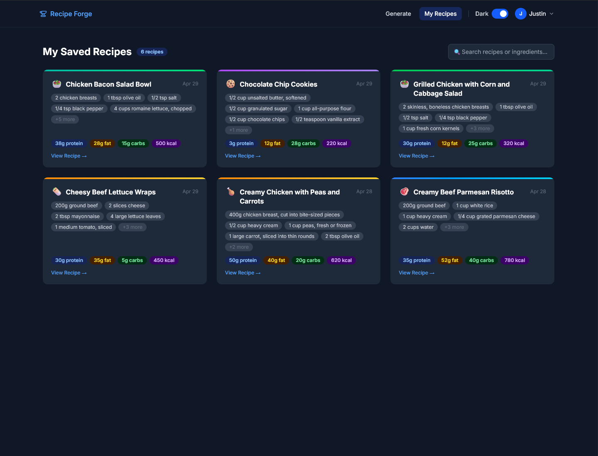
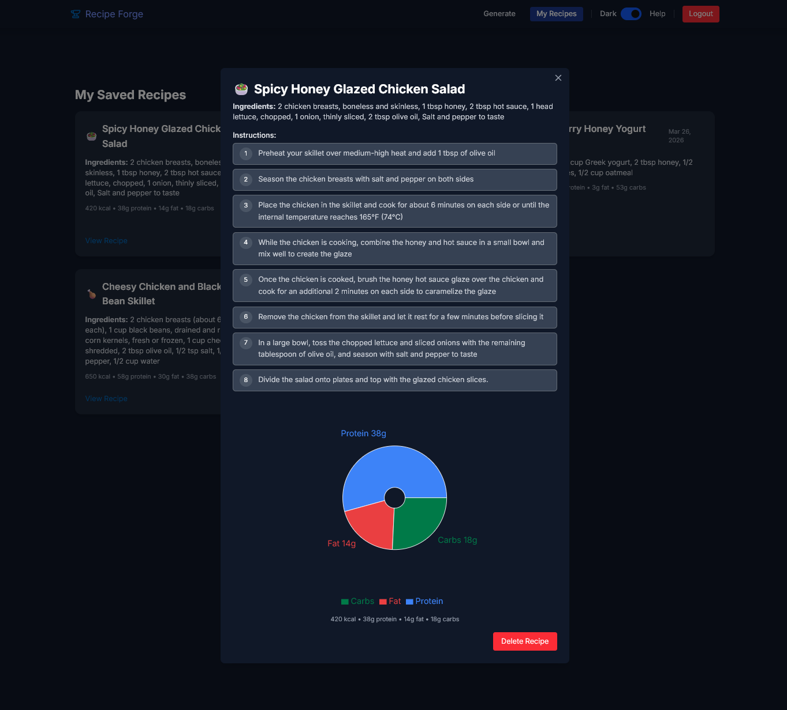

# Recipe Forge

[](https://github.com/justinhdev/recipe-forge/actions/workflows/ci.yml)

<p align="center">
  AI-powered recipe generator built with <strong>React</strong>, <strong>TypeScript</strong>, <strong>Node.js/Express</strong>, <strong>PostgreSQL</strong>, and <strong>Prisma</strong>.
</p>

<p align="center">
  Generate structured recipes from available ingredients, tailor outputs with nutrition and cuisine preferences, and save results to a personal dashboard.
</p>

<p align="center">
  <a href="https://recipe.justinhdev.com"><strong>Live Demo</strong></a>
  ·
  <a href="https://github.com/justinhdev/recipe-forge"><strong>Source Code</strong></a>
</p>

<p align="center">
  
  
  
  
  
  
  
</p>

---

## Overview

Recipe Forge is a full-stack web application that turns user-selected ingredients into structured recipes with macro breakdowns using the OpenAI API. Users can tailor recipe generation with options like servings, diet, cuisine, meal type, macro preference, and creativity level, then save recipes to their account for later access.

This project was built to deepen hands-on experience with modern full-stack development, especially:
- TypeScript across frontend and backend
- API design with Express
- PostgreSQL data modeling with Prisma
- JWT authentication and protected routes
- integrating structured LLM outputs into an app workflow
- runtime validation with Zod across request and response boundaries

---

## Features

- Ingredient-driven recipe generation with structured macro output
- Configurable servings, diet, cuisine, meal type, macro priority, and creativity level
- JWT-based authentication with protected routes for saved recipes
- Rate limiting on authentication and AI generation routes
- Structured API logging with request correlation IDs
- Durable AI generation metrics for latency, status, token usage, and estimated cost
- Protected internal stats dashboard for monitoring the OpenAI integration
- Persistent recipe storage with authenticated create, list, and delete flows
- Zod validation across request bodies, route params, and OpenAI response parsing
- Shared frontend contract types aligned with backend request and response shapes
- API test coverage with Vitest and Supertest
- Responsive React UI with loading, error, and empty states

---

## Tech Stack

### Frontend
- React
- TypeScript
- Tailwind CSS
- Framer Motion
- Axios

### Backend
- Node.js
- Express
- TypeScript
- Prisma ORM
- PostgreSQL
- JWT authentication
- OpenAI API
- Zod
- Pino
- Vitest
- Supertest

---

## Architecture

Recipe Forge is split into two applications:

```text
recipe-forge/
├── client/   # React frontend
└── server/   # Express API + Prisma + PostgreSQL
```

### Frontend responsibilities
- ingredient selection and recipe options UI
- sending recipe-generation requests
- displaying generated recipe results
- saving recipes for authenticated users

### Backend responsibilities
- user registration and login
- JWT authentication and protected routes
- request validation with Zod middleware
- OpenAI-powered recipe generation with structured output validation
- pino-powered JSON request logs written to stdout for Render log ingestion
- durable RecipeGeneration metrics in PostgreSQL for latency, status, token usage, estimated cost, and validation failures
- protected admin stats endpoint for generation success rate, p50/p95 latency, cost, model usage, and failure reasons
- automated integration and unit tests for API behavior and helper logic
- recipe persistence with Prisma and PostgreSQL

### Deployment
- frontend hosted on Vercel
- Express API hosted on Render
- PostgreSQL hosted on Neon

---

## How It Works

1. A user selects ingredients and optional recipe preferences.
2. The frontend sends a request to the Express API.
3. The backend validates the request body with Zod before any controller logic runs.
4. The backend builds a prompt and sends it to the OpenAI API.
5. The OpenAI response is parsed as structured output and validated against a Zod schema.
6. The generated recipe is validated again against the API response shape, then returned to the frontend.
7. Authenticated users can save recipes and manage them later.

### Validation flow

- `server/src/schemas/` contains the request and OpenAI response schemas
- `server/src/middleware/validate.middleware.ts` validates request bodies and params at the route layer
- `server/src/middleware/error.middleware.ts` converts `ZodError`s into clean `400` responses
- `client/src/types/contracts.ts` mirrors the API contracts used by the frontend

### Testing flow

- `server/src/test/auth.integration.test.ts` covers auth registration and login behavior
- `server/src/test/recipes.integration.test.ts` covers authenticated recipe create/list/delete behavior
- `server/src/test/openai.service.unit.test.ts` mocks OpenAI and tests prompt-building behavior without hitting the real API
- `server/src/test/jwt.utils.unit.test.ts` covers JWT helper behavior
- `server/src/test/admin.integration.test.ts` covers protected access and metric aggregation for the admin stats endpoint
- `server/src/test/test-env.ts` rewrites the Prisma connection to use a dedicated Postgres `test` schema
- `server/src/test/setup.ts` runs `prisma db push` automatically and clears test data between runs

---

## API Routes

### Auth
- `POST /api/auth/register`
- `POST /api/auth/login`

### AI
- `POST /api/ai/generate`

### Recipes
- `GET /api/recipes`
- `POST /api/recipes`
- `DELETE /api/recipes/:id`

### Admin
- `GET /api/admin/stats`

The admin stats endpoint is protected by JWT auth. If `ADMIN_EMAILS` is set, only users whose email appears in that comma-separated list can access it.

---

## Screenshots

<h3 align="center">Recipe Generation Workflow</h3>
<p align="center">
  
</p>

<h3 align="center">Saved Recipes Dashboard</h3>
<p align="center">
  
</p>

<h3 align="center">Recipe Detail Modal with Macro Breakdown</h3>
<p align="center">
  
</p>

---

## Local Development

### Prerequisites
- Node.js
- npm
- PostgreSQL
- OpenAI API key

### Environment variables

`server/.env`

```env
DATABASE_URL=your_postgresql_connection_string
TEST_DATABASE_URL=your_test_postgresql_connection_string
JWT_SECRET=your_jwt_secret
OPENAI_API_KEY=your_openai_api_key
OPENAI_MODEL=gpt-4o-2024-08-06
OPENAI_INPUT_COST_PER_1M=2.50
OPENAI_OUTPUT_COST_PER_1M=10.00
ADMIN_EMAILS=you@example.com
CLIENT_URL=http://localhost:5173
PORT=3000
```

`client/.env`

```env
VITE_API_URL=http://localhost:3000
```

### Run locally

```bash
git clone https://github.com/justinhdev/recipe-forge.git
cd recipe-forge
cd client && npm install
cd ../server && npm install
npx prisma migrate dev
npm run dev
```

In a second terminal:

```bash
cd client
npm run dev
```

### Tests

From `server/`:

```bash
npm test
```

The server test suite requires `TEST_DATABASE_URL`, rewrites it to use a separate Postgres schema named `test`, runs `prisma db push`, and clears data between test runs.

From `client/`:

```bash
npm test
```
