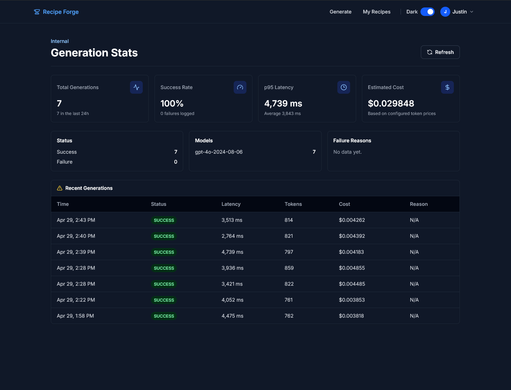

# Recipe Forge

[](https://github.com/justinhdev/recipe-forge/actions/workflows/ci.yml)

<p align="center">
  <strong>Full-stack AI recipe generator with structured OpenAI outputs, validated API contracts, authenticated persistence, and production-style observability.</strong>
</p>

<p align="center">
  <a href="https://recipe.justinhdev.com"><strong>Live Demo</strong></a>
  ·
  <a href="https://github.com/justinhdev/recipe-forge"><strong>Source Code</strong></a>
</p>

<p align="center">
  
  
  
  
  
  
  
</p>

---

## Overview

Recipe Forge turns a user's available ingredients into structured recipes with macro breakdowns. Users can tune generation by servings, diet, cuisine, meal type, macro priority, and creativity level, then save generated recipes to an authenticated dashboard.

The project is built as a production-style full-stack application rather than a thin AI demo. The backend validates user input and OpenAI responses with Zod, persists user recipes and generation metrics in PostgreSQL, emits structured JSON logs with request correlation IDs, and exposes a protected internal stats dashboard for monitoring the OpenAI workflow.

## Highlights

- Full-stack TypeScript application with React, Tailwind CSS, Express, Prisma, and PostgreSQL
- OpenAI structured output integration with runtime validation before responses reach the UI
- JWT authentication for saved recipe create, list, and delete flows
- Durable AI generation metrics for success/failure status, latency, token usage, estimated cost, model, prompt version, and validation failures
- Pino structured API logs written to stdout for Render log ingestion, with per-request correlation IDs
- Protected internal admin dashboard for total generations, success rate, p50/p95 latency, estimated cost, model usage, recent requests, and failure reasons
- Integration and unit tests covering auth, recipe CRUD, rate limiting, JWT helpers, OpenAI prompt behavior, and admin metric aggregation
- Deployed with Vercel, Render, Neon PostgreSQL, Prisma migrations, and GitHub Actions CI

## Product Screenshots

### Recipe Generation Workflow

<p align="center">
  
</p>

### Saved Recipes Dashboard

<p align="center">
  
</p>

### Admin Observability Dashboard

<p align="center">
  
</p>

## Tech Stack

### Frontend

- React
- TypeScript
- Tailwind CSS
- Framer Motion
- Axios
- Vite

### Backend

- Node.js
- Express
- TypeScript
- Prisma ORM
- PostgreSQL
- JWT authentication
- OpenAI API
- Zod
- Pino
- Vitest
- Supertest

### Deployment

- Frontend: Vercel
- API: Render
- Database: Neon PostgreSQL
- CI: GitHub Actions

## Architecture

```text
recipe-forge/
├── client/   # React + TypeScript frontend
└── server/   # Express API + Prisma + PostgreSQL
```

### Request Flow

1. The user selects ingredients and generation options in the React UI.
2. The frontend sends a typed request to the Express API.
3. The backend validates the request body with Zod.
4. The backend builds a constrained OpenAI prompt and requests a structured recipe response.
5. The OpenAI response is parsed and validated against a Zod schema.
6. The API sanitizes and validates the final response body before returning it.
7. The backend records generation metrics, including latency, status, token usage, estimated cost, model, prompt version, and any validation failures.
8. Authenticated users can save generated recipes and manage them later.

### Observability

Recipe Forge includes a lightweight observability layer for the AI workflow:

- `pino` emits structured JSON request logs to stdout, which Render captures automatically.
- Each request receives a correlation ID exposed through the `X-Request-Id` response header.
- OpenAI generation attempts are persisted in the `RecipeGeneration` table.
- The protected `/api/admin/stats` endpoint aggregates operational metrics for the admin dashboard.
- The `/admin/stats` page displays total generations, success rate, p50/p95 latency, estimated cost, model usage, failure reasons, and recent requests.

Cost is estimated from token usage returned by the OpenAI API response and configurable per-million-token prices:

```env
OPENAI_INPUT_COST_PER_1M=2.50
OPENAI_OUTPUT_COST_PER_1M=10.00
```

### Validation

- `server/src/schemas/` defines request, route param, recipe, and OpenAI response schemas.
- `server/src/middleware/validate.middleware.ts` validates request bodies and params at the route layer.
- `server/src/middleware/error.middleware.ts` returns consistent API errors and logs structured failures.
- `client/src/types/contracts.ts` mirrors backend request and response contracts used by the frontend.

## API Routes

### Auth

- `POST /api/auth/register`
- `POST /api/auth/login`

### AI

- `POST /api/ai/generate`

### Recipes

- `GET /api/recipes`
- `POST /api/recipes`
- `DELETE /api/recipes/:id`

### Admin

- `GET /api/admin/stats`

The admin stats endpoint requires JWT authentication. If `ADMIN_EMAILS` is set, only users whose email appears in that comma-separated list can access it.

## Testing

Server tests use Vitest and Supertest:

- `auth.integration.test.ts` covers registration, login, duplicate email handling, and invalid credentials.
- `recipes.integration.test.ts` covers authenticated recipe create, list, and delete behavior.
- `rate-limit.integration.test.ts` covers auth and AI generation rate limits.
- `openai.service.unit.test.ts` mocks OpenAI and verifies prompt construction and refusal handling.
- `jwt.utils.unit.test.ts` covers JWT helper behavior.
- `admin.integration.test.ts` covers protected stats access and metric aggregation.

The server test suite uses `TEST_DATABASE_URL`, rewrites it to a dedicated `test` schema, runs `prisma db push`, and clears data between test runs.

Client tests cover core UI and utility behavior with Vitest and React Testing Library.

## Local Development

### Prerequisites

- Node.js
- npm
- PostgreSQL
- OpenAI API key

### Environment Variables

`server/.env`

```env
DATABASE_URL=your_postgresql_connection_string
TEST_DATABASE_URL=your_test_postgresql_connection_string
JWT_SECRET=your_jwt_secret
OPENAI_API_KEY=your_openai_api_key
OPENAI_MODEL=gpt-4o-2024-08-06
OPENAI_INPUT_COST_PER_1M=2.50
OPENAI_OUTPUT_COST_PER_1M=10.00
ADMIN_EMAILS=you@example.com
CLIENT_URL=http://localhost:5173
PORT=3000
```

`client/.env`

```env
VITE_API_URL=http://localhost:3000
```

### Install and Run

```bash
git clone https://github.com/justinhdev/recipe-forge.git
cd recipe-forge
```

Install and start the API:

```bash
cd server
npm install
npx prisma migrate dev
npm run dev
```

In a second terminal, install and start the frontend:

```bash
cd client
npm install
npm run dev
```

### Run Tests

From `server/`:

```bash
npm test
```

From `client/`:

```bash
npm test
```

### Production Migration

Render should run Prisma migrations before starting the API:

```bash
npx prisma migrate deploy && npm run start
```
